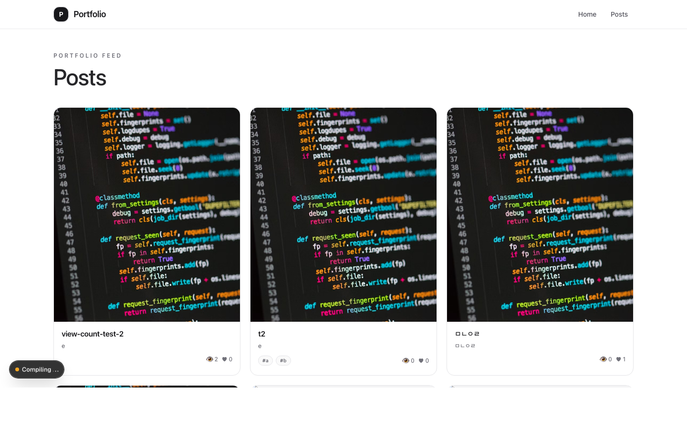
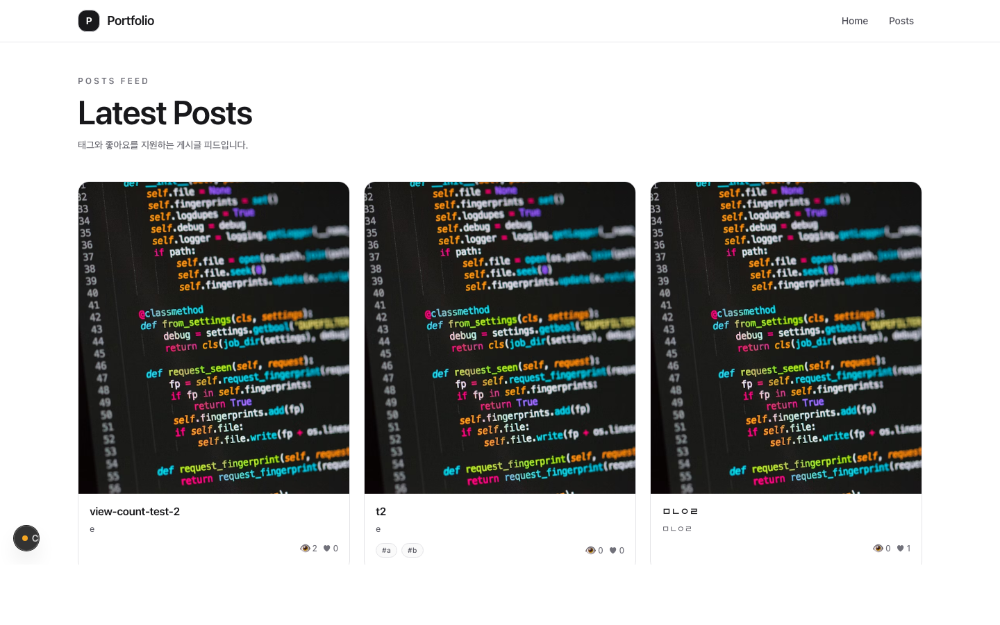
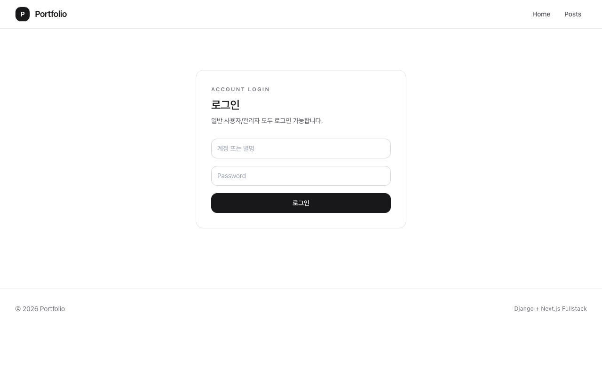
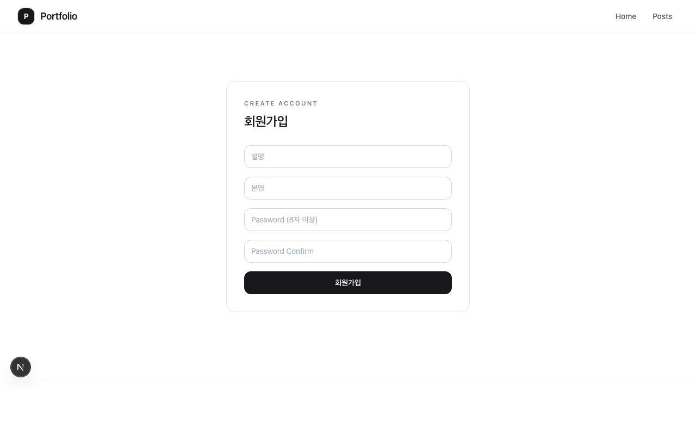
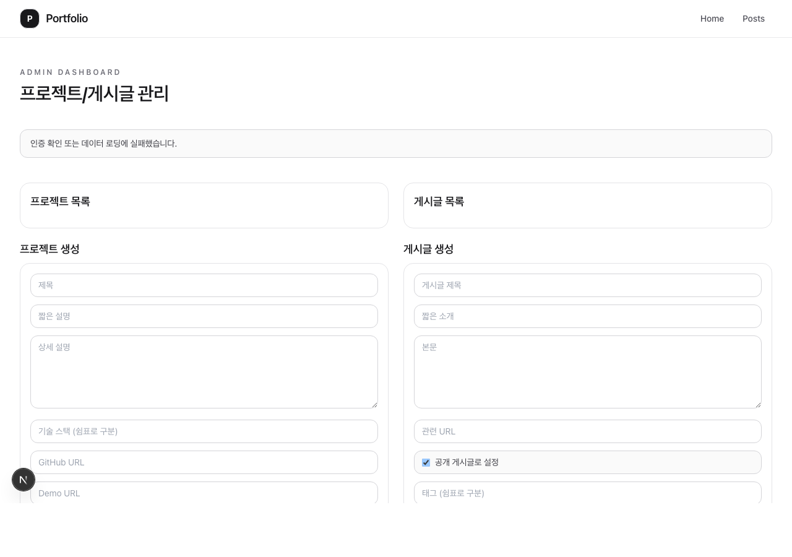

# Portfolio Fullstack (Django + Next.js)

현재 기준 가장 쉬운 배포 방식:
- Backend: Render (Django + Postgres + Supabase Storage)
- Frontend: Vercel (Next.js)

---

## 화면 미리보기

### 홈 (게시글 피드)


### 게시글 목록


### 로그인


### 회원가입


### 관리자 대시보드


## 1) 로컬 실행

### Backend
```bash
cd backend
python3 -m venv .venv
source .venv/bin/activate
pip install -r requirements.txt
cp .env.example .env
python manage.py makemigrations
python manage.py migrate
python manage.py runserver 8000
```

### Frontend
```bash
cd frontend
cp .env.example .env.local
npm install
npm run dev
```

---

## 2) 계정 정책

- 회원가입 입력값은 `별명`, `본명`, `비밀번호`입니다.
- `본명`은 필수값입니다.
- 사용자가 직접 계정(username)을 입력하지 않아도 서버가 별명을 기준으로 자동 생성합니다.
- 로그인은 `계정(username)` 또는 `별명`으로 가능합니다.
- 사용자 표시는 기본적으로 `별명(계정)` 형식을 사용합니다.
- 내 계정 페이지에서 `별명`과 `본명`을 수정할 수 있습니다.

---

## 3) 배포 방식 (권장)

### A. Render 백엔드 배포

저장소 루트에 `render.yaml`이 이미 있습니다.

#### Render에서 할 일
1. Render 로그인
2. `New Project` → `Deploy from GitHub repo`
3. 저장소 선택: `willight1/Portfolio`
4. 배포 시작

#### 서비스 설정 확인
- Build/Start command는 `render.yaml`이 자동 적용
- Port는 Render가 자동 주입

#### Postgres 연결
1. `render.yaml` 기준으로 Postgres가 함께 생성됨
2. 백엔드 서비스 `Environment`에서 `DATABASE_URL`이 연결되었는지 확인

#### Backend 환경변수
Render 백엔드 서비스 Environment에 아래 입력:
```env
DJANGO_SECRET_KEY=강한_랜덤_문자열
DJANGO_DEBUG=False
DJANGO_ALLOWED_HOSTS=<render-백엔드-도메인>
FRONTEND_ORIGINS=https://<vercel-프론트-도메인>

SESSION_COOKIE_SAMESITE=None
CSRF_COOKIE_SAMESITE=None
SESSION_COOKIE_SECURE=True
CSRF_COOKIE_SECURE=True
SECURE_SSL_REDIRECT=True

USE_S3=True
SUPABASE_S3_ACCESS_KEY_ID=<supabase-access-key-id>
SUPABASE_S3_SECRET_ACCESS_KEY=<supabase-secret-access-key>
SUPABASE_S3_BUCKET_NAME=portfolio-media
```

#### Supabase Storage 연결
1. Supabase 대시보드 → 프로젝트 `csiwpekpqakitvqdqaxw`
2. `Storage` → `S3 Connection` 또는 `Policies`
3. `New access key` 생성
4. 발급된 키를 Render 환경변수 `SUPABASE_S3_ACCESS_KEY_ID`, `SUPABASE_S3_SECRET_ACCESS_KEY`에 입력
5. 버킷 `portfolio-media`의 공개 읽기 정책이 켜져 있는지 확인

### B. Vercel 프론트 배포

1. Vercel 로그인
2. `Add New` → `Project`
3. 같은 GitHub repo 선택
4. `Root Directory`를 `frontend`로 설정
5. Environment Variables 추가:
```env
NEXT_PUBLIC_API_BASE_URL=https://<render-백엔드-도메인>
NEXT_PUBLIC_SITE_URL=https://<vercel-프론트-도메인>
```
6. Deploy

### C. 마지막 연결
- Render `FRONTEND_ORIGINS`를 실제 Vercel 도메인으로 맞춤
- Render 재배포
- Vercel 재배포

---

## 4) 권한 정책

- 비로그인
  - 홈 게시글 목록 조회 가능
  - 프로젝트/게시글 상세 조회 가능
- 로그인
  - 회원가입 직후 자동 로그인
  - 게시글 작성 가능
  - 본인 게시글만 수정/삭제 가능 (staff 예외)
  - 댓글/댓글좋아요 가능
  - 팔로우/팔로잉/팔로워 기능 사용 가능
  - 계정 페이지에서 별명/본명 수정 가능

---

## 5) 주요 API

### Auth
- `GET /api/auth/csrf/`
- `POST /api/auth/register/`
- `POST /api/auth/login/`
- `POST /api/auth/logout/`
- `GET /api/auth/me/`
- `PATCH /api/auth/profile/`
- `POST /api/auth/change-password/`
- `POST /api/auth/withdraw/`

#### 회원가입 요청 예시
```json
{
  "nickname": "주노",
  "name": "김주노",
  "password": "password1234",
  "password_confirm": "password1234"
}
```

#### 로그인 요청 예시
```json
{
  "identifier": "주노",
  "password": "password1234"
}
```

#### 프로필 수정 요청 예시
```json
{
  "nickname": "주노",
  "name": "김주노"
}
```

### Follow
- `GET /api/auth/following/`
- `GET /api/auth/followers/`
- `GET /api/auth/follow/<username>/status/`
- `POST /api/auth/follow/<username>/`
- `DELETE /api/auth/follow/<username>/`

### Posts
- `GET /api/posts/`
- `GET /api/posts/author/<username>/`
- `GET /api/posts/<slug>/` (로그인 필요)
- `POST /api/posts/` (로그인)
- `PUT /api/posts/<id>/` (작성자/staff)
- `DELETE /api/posts/<id>/` (작성자/staff)
- `POST /api/posts/<id>/like/`

### Comments
- `GET /api/posts/<post_id>/comments/`
- `POST /api/posts/<post_id>/comments/`
- `PATCH /api/comments/<id>/`
- `DELETE /api/comments/<id>/`
- `POST /api/comments/<id>/like/`
